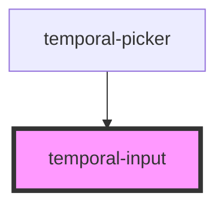

# temporal-input

<!-- Auto Generated Below -->

## Properties

| Property   | Attribute  | Description       | Type                                                 | Default     |
| ---------- | ---------- | ----------------- | ---------------------------------------------------- | ----------- |
| `disabled` | `disabled` |                   | `boolean`                                            | `undefined` |
| `max`      | `max`      | The max value     | `string`                                             | `undefined` |
| `min`      | `min`      | The min value     | `string`                                             | `undefined` |
| `native`   | `native`   | The native value  | `boolean`                                            | `undefined` |
| `plain`    | `plain`    | The plain of type | `"date" \| "datetime" \| "day" \| "month" \| "time"` | `'date'`    |
| `readonly` | `readonly` |                   | `boolean`                                            | `undefined` |
| `value`    | `value`    | The value of date | `string`                                             | `undefined` |

## Events

| Event         | Description            | Type                              |
| ------------- | ---------------------- | --------------------------------- |
| `closePopup`  | The close popup event  | `CustomEvent<void>`               |
| `openPopup`   | The close popup event  | `CustomEvent<void>`               |
| `valueChange` | The value change event | `CustomEvent<{ value: string; }>` |

## Shadow Parts

| Part      | Description |
| --------- | ----------- |
| `"input"` |             |

## Dependencies

### Used by

 - [temporal-picker](../temporal-picker)

### Graph

----------------------------------------------

*Built with [StencilJS](https://stenciljs.com/)*
