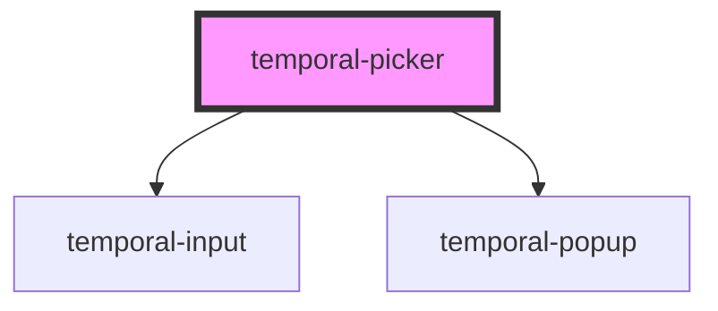

# temporal-picker

<!-- Auto Generated Below -->

## Properties

| Property         | Attribute         | Description                   | Type                                                 | Default          |
| ---------------- | ----------------- | ----------------------------- | ---------------------------------------------------- | ---------------- |
| `autoApply`      | `auto-apply`      |                               | `boolean`                                            | `undefined`      |
| `disabled`       | `disabled`        |                               | `boolean`                                            | `undefined`      |
| `end`            | `end`             | The end value of date range   | `string`                                             | `undefined`      |
| `extraSelect`    | `extra-select`    |                               | `boolean`                                            | `undefined`      |
| `max`            | `max`             | The max value                 | `string`                                             | `undefined`      |
| `min`            | `min`             | The min value                 | `string`                                             | `undefined`      |
| `native`         | `native`          | The native value              | `boolean`                                            | `undefined`      |
| `placement`      | `placement`       |                               | `"bottom-end" \| "bottom-start"`                     | `'bottom-start'` |
| `plain`          | `plain`           | The type of picker            | `"date" \| "datetime" \| "day" \| "month" \| "time"` | `'date'`         |
| `presetPosition` | `preset-position` |                               | `"bottom" \| "left" \| "right" \| "top"`             | `undefined`      |
| `readonly`       | `readonly`        |                               | `boolean`                                            | `undefined`      |
| `resetButton`    | `reset-button`    |                               | `boolean`                                            | `undefined`      |
| `start`          | `start`           | The start value of date range | `string`                                             | `undefined`      |
| `type`           | `type`            | The type of picker            | `"plain" \| "range"`                                 | `'plain'`        |
| `value`          | `value`           | The value of date             | `string`                                             | `undefined`      |

## Events

| Event            | Description            | Type                                           |
| ---------------- | ---------------------- | ---------------------------------------------- |
| `t-range-change` | The range change event | `CustomEvent<{ start: string; end: string; }>` |
| `t-value-change` | The value change event | `CustomEvent<{ value: string; }>`              |

## Shadow Parts

| Part                     | Description |
| ------------------------ | ----------- |
| `"delimiter"`            |             |
| `"range-inputs-wrapper"` |             |

## Dependencies

### Depends on

- [temporal-input](../temporal-input)
- [temporal-popup](../temporal-popup)

### Graph

----------------------------------------------

*Built with [StencilJS](https://stenciljs.com/)*
