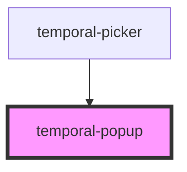

# temporal-popup

<!-- Auto Generated Below -->

## Properties

| Property         | Attribute         | Description                   | Type                                     | Default     |
| ---------------- | ----------------- | ----------------------------- | ---------------------------------------- | ----------- |
| `autoApply`      | `auto-apply`      |                               | `boolean`                                | `undefined` |
| `end`            | `end`             | The end value of date range   | `string`                                 | `undefined` |
| `max`            | `max`             | The max value                 | `string`                                 | `undefined` |
| `min`            | `min`             | The min value                 | `string`                                 | `undefined` |
| `monthSelect`    | `month-select`    |                               | `boolean`                                | `undefined` |
| `parent`         | --                |                               | `HTMLElement`                            | `undefined` |
| `presetPosition` | `preset-position` |                               | `"bottom" \| "left" \| "right" \| "top"` | `undefined` |
| `resetButton`    | `reset-button`    |                               | `boolean`                                | `undefined` |
| `start`          | `start`           | The start value of date range | `string`                                 | `undefined` |
| `type`           | `type`            | The type of picker            | `"plain" \| "range"`                     | `'plain'`   |
| `value`          | `value`           | The start value of date range | `string`                                 | `undefined` |
| `yearSelect`     | `year-select`     |                               | `boolean`                                | `undefined` |

## Events

| Event         | Description            | Type                                           |
| ------------- | ---------------------- | ---------------------------------------------- |
| `closePopup`  | The close popup event  | `CustomEvent<void>`                            |
| `rangeChange` | The range change event | `CustomEvent<{ start: string; end: string; }>` |
| `valueChange` | The value change event | `CustomEvent<{ value: string; }>`              |

## Methods

### `gotoDate() => Promise<void>`

#### Returns

Type: `Promise<void>`

### `gotoEnd() => Promise<void>`

#### Returns

Type: `Promise<void>`

### `gotoStart() => Promise<void>`

#### Returns

Type: `Promise<void>`

## Dependencies

### Used by

 - [temporal-picker](../temporal-picker)

### Graph

----------------------------------------------

*Built with [StencilJS](https://stenciljs.com/)*
