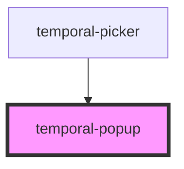

# temporal-popup

<!-- Auto Generated Below -->

## Properties

| Property         | Attribute         | Description                   | Type                                                 | Default     |
| ---------------- | ----------------- | ----------------------------- | ---------------------------------------------------- | ----------- |
| `autoApply`      | `auto-apply`      |                               | `boolean`                                            | `undefined` |
| `customLayout`   | `custom-layout`   |                               | `boolean`                                            | `undefined` |
| `end`            | `end`             | The end value of date range   | `string`                                             | `undefined` |
| `extraSelect`    | `extra-select`    |                               | `boolean`                                            | `undefined` |
| `firstDay`       | `first-day`       |                               | `number`                                             | `undefined` |
| `locale`         | `locale`          |                               | `string`                                             | `undefined` |
| `localeApply`    | `locale-apply`    |                               | `string`                                             | `undefined` |
| `localeCancel`   | `locale-cancel`   |                               | `string`                                             | `undefined` |
| `localeClear`    | `locale-clear`    |                               | `string`                                             | `undefined` |
| `max`            | `max`             | The max value                 | `string`                                             | `undefined` |
| `min`            | `min`             | The min value                 | `string`                                             | `undefined` |
| `pickHover`      | `pick-hover`      |                               | `boolean`                                            | `undefined` |
| `picker`         | --                |                               | `HTMLElement`                                        | `undefined` |
| `plain`          | `plain`           | The type of picker            | `"date" \| "datetime" \| "day" \| "month" \| "time"` | `'date'`    |
| `presetPosition` | `preset-position` |                               | `"bottom" \| "left" \| "right" \| "top"`             | `undefined` |
| `reselect`       | `reselect`        |                               | `boolean`                                            | `undefined` |
| `resetButton`    | `reset-button`    |                               | `boolean`                                            | `undefined` |
| `rowHeader`      | `row-header`      |                               | `boolean`                                            | `undefined` |
| `start`          | `start`           | The start value of date range | `string`                                             | `undefined` |
| `strict`         | `strict`          |                               | `boolean`                                            | `undefined` |
| `tooltip`        | `tooltip`         |                               | `boolean`                                            | `undefined` |
| `type`           | `type`            | The type of picker            | `"plain" \| "range"`                                 | `'plain'`   |
| `value`          | `value`           | The start value of date range | `string`                                             | `undefined` |

## Events

| Event            | Description            | Type                                           |
| ---------------- | ---------------------- | ---------------------------------------------- |
| `t-close-popup`  | The close popup event  | `CustomEvent<void>`                            |
| `t-range-change` | The range change event | `CustomEvent<{ start: string; end: string; }>` |
| `t-value-change` | The value change event | `CustomEvent<{ value: string; }>`              |

## Methods

### `scrollToIndex(index: number) => Promise<void>`

#### Returns

Type: `Promise<void>`

### `select(values: string[], scrollToIndex?: number) => Promise<void>`

#### Returns

Type: `Promise<void>`

## Dependencies

### Used by

 - [temporal-picker](../temporal-picker)

### Graph

----------------------------------------------

*Built with [StencilJS](https://stenciljs.com/)*
